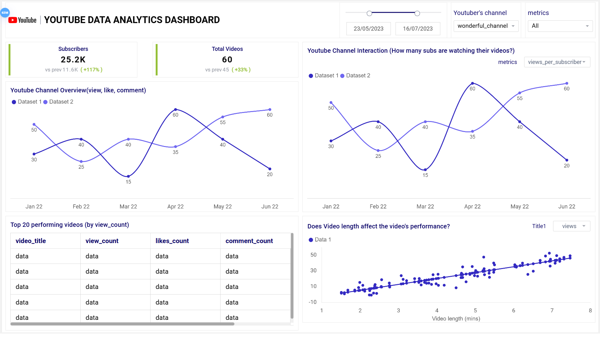

# Data Portfolio: Youtube Channel Data Analysis 

# Table of Contents

- [Objectives](#objectives)
- [Data source](#data-source)
- [Stages](#stages)
- [Design](#design)
  - [Mockup](#mockup)
  - [Tools](#tools)
- [Development](#development)
  - [Pseudocode](#pseudocode)
  - [Data Collection](#data-collection)

# Objectives

- What is the key pain point?

The client wants to:

1. Identify what videos are performing the best on their youtube channel
2. Identify what kind of content famous Nigerian food content creators have made this year.

- What is the ideal solution? 

1. Build a dashboard to provide insights in their channel's performance on different metrics such as:
    - view count
    - like count
    - comment count
2. Provide recommendations on content she can upload on their channel

Metrics

1. views_per_subscribers: Dividing the View count by the subscribers count of the channel
2. likes_per_subscribers: Dividing the Like count by the subscribers count of the channel
3. likes_per_view: Dividing the Like count by the View count

# Data source

- What data is needed to achieve our objective?

We need data on the top Nigerian Food Content Creators in 2024 that includes the:

- channel's name
- total subscribers
- video title
- video duration
- date released
- view count
- like count
- comment count

- Where is the data coming from? 
The data is scraped from youtube using the Selenium, BrightData and Youtube API.

# Stages

- Design
- Development
- Testing
- Analysis

# Design

## Dashboard components required

- What should the dashboard contain based on the requirements provided?

To understand what it should contain, we need to figure out what questions we need the dashboard to answer:

1. What videos are getting views higher than the youtuber's subscriber count ?
2. What are the top 10 videos by view count ? 
3. What are the top 10 videos by like count ?
4. What are the top 10 videos by comment count ?
5. How does video length correlate with views/likes/comment?
6. Give recommedations on popular videos.

## Dashboad Mockup

This dashboard consists of various visualizations which includes:

1. Line chart
2. Tables
3. Scatterplots
4. Date slicer
5. Cards

## Tools

| Tool | Purpose |
| --- | --- |
| Python | Extracting, cleaning, testing, and analyzing the data |
| Mokkup AI | Designing the wireframe/mockup of the dashboard |
| Tableau | Visualizing the data via interactive dashboards |
| GitHub | Hosting the project documentation and version control |

# Development

## Psuedocode

The steps used in providing solutions involves:

1. Get the data
2. Clean the data
3. Analyze the data
4. Visualize the data in Tableau
5. Generate the findings based on the insights
6. Write the documentation + commentary

## Data collection

The data needed for the analysis will be extracted from youtube using the Selenium. The list of youtubers to be focused on for this project was extracted from this [website](https://videos.feedspot.com/nigeria_food_youtube_channels/). The data collected were stored in two different files. The first file named ***youtuber_channel_details.csv*** contains:

1. Youtuber's channel name
2. Subscriber count
3. Total video count

The next file or rather collection of files are named after each individual youtuber's channel name and contains:

1. Video Title
2. Date video was released (UTC)
3. View count
4. Like count
5. Comment count
6. Date data was collected (UTC)
7. Video duration in hours
8. Video duration in minutes
9. Video duration in seconds

